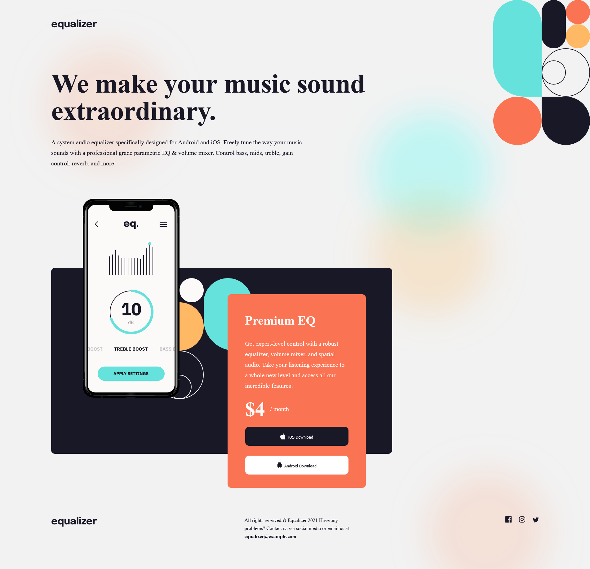
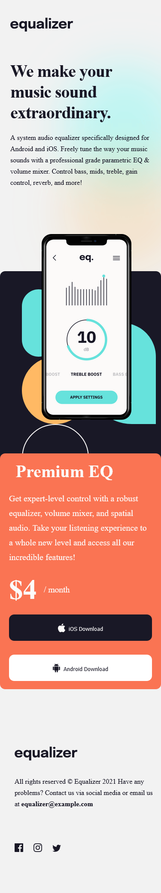
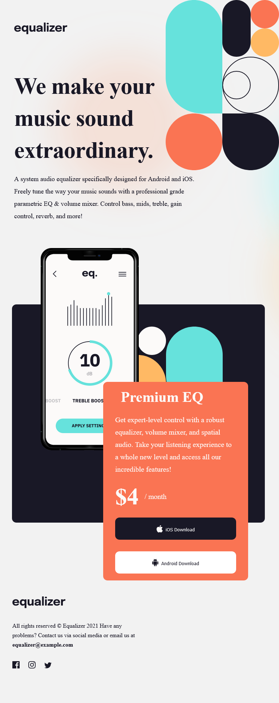

## Table of contents

- [Overview](#overview)
  - [The challenge](#the-challenge)
  - [Screenshot](#screenshot)
  - [Links](#links)
- [My process](#my-process)
  - [Built with](#built-with)
  - [What I learned](#what-i-learned)
  - [Continued development](#continued-development)
  - [Useful resources](#useful-resources)
- [Author](#author)
- [Acknowledgments](#acknowledgments)

## Overview

In this project I mainly needed to focus on page layout and page responsiveness.

### The challenge

Users should be able to:

- View the optimal layout depending on their device's screen size

### Screenshot

### Links

- Solution URL: [GitHub Code](https://github.com/Tusho7/Equalizer-Landing-Page)
- Live Site URL: [GitHub Live](https://tusho7.github.io/Equalizer-Landing-Page/)

## My process
Change background color of body
Add background image of divs
Add text
Give images sizes and styles in CSS
Give texts font styles in CSS
Create hover effects in CSS

### Built with

- Semantic HTML5 markup
- CSS custom properties
- Flexbox 
- Media Queries

### What I learned

While working on this project, I gained more practise of using Media Queries, the main challenge that I overcame was to create responsive page that would work on mobile and tablet and create layout of images and texts specifically like it is shown in design. This was my first attempt to make it responsive.

### Continued development

I want to create other projects like this to finally master coding and make more dynamic,interactive and responsive projects.

## Author

- GitHub - [Sandro Tushurashvili](https://github.com/Tusho7)
- LinkedIn - [Sandro Tushurashvili](https://www.linkedin.com/in/sandro-tushurashvili/)

